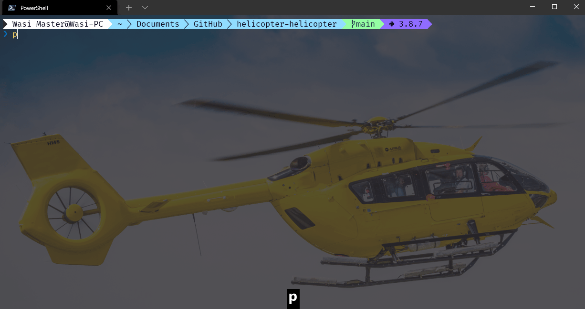

# helicopter-helicopter

Helicopter animation in terminal

## Why does this exist?
It's because of a meme

Click for details

See [this page](https://wiki.projecttopics.org/982409-what-is-helicopter-helicopter-meme-viral-tiktok-song-explore/index.html "Meme explanation") for a highly detailed explanation

### The origins
> The helicopter helicopter is a meme that got generated around November of this year.
> According to YouTube, the original video is about five seconds long. The video features a young Arab boy that has placed himself as a seat for the motorbike.
> His face is the headlight while his hands rest on the wheel of the Transformer-like vehicle.
> The serious expression on the boy’s face makes the video even more hilarious.
> The shot clip has managed to gather over 150,000 views in a few short days.
> On TikTok, the sound is famous as Helikopter by Fezlija.

### The creator
> The singer behind the Helikoppter helipkopter meme is none other then Fazlija. He is a 49 year old mucison fomr Bosnia and herzegovinea.
> The singer released the song back in 2015. After a few creators used the tune for their background music, the sound started getting the recognition it deserves.
> It seems that the song has yet to have an English translation. According to Know your meme, the sone is about money and helicopter.
> The youtube videos have about 2 million views.

These memes usually have a music where a person with a arabic accent sings helikopter, helikopter\
There are three versions of this song: [#1](https://youtu.be/neDWGg2mGqo "1st Song"), [#2](https://youtu.be/neDWGg2mGqo?t=10 "2nd Song"), [#3](https://youtu.be/neDWGg2mGqo?t=33 "3rd Song")

## Installation

Either clone the repo or download it as zip by clicking [here](https://github.com/wasi-master/helicopter-helicopter/archive/refs/heads/main.zip)
If you downloaded the zip file then extract it to some folder
If you cloned the repo then go to the folder named `helicopter-helicopter`
Then run `heli.py`.
To exit press <kbd>Ctrl+C</kbd>

## Demo

